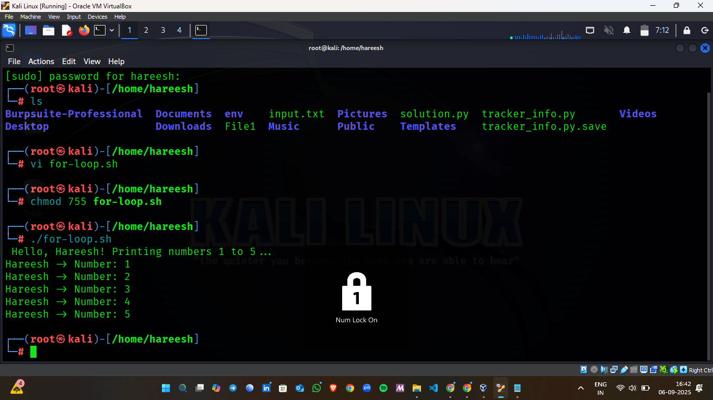
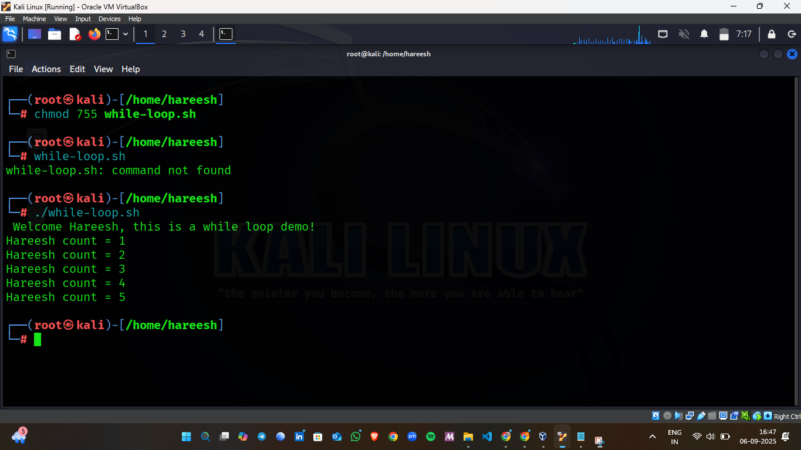
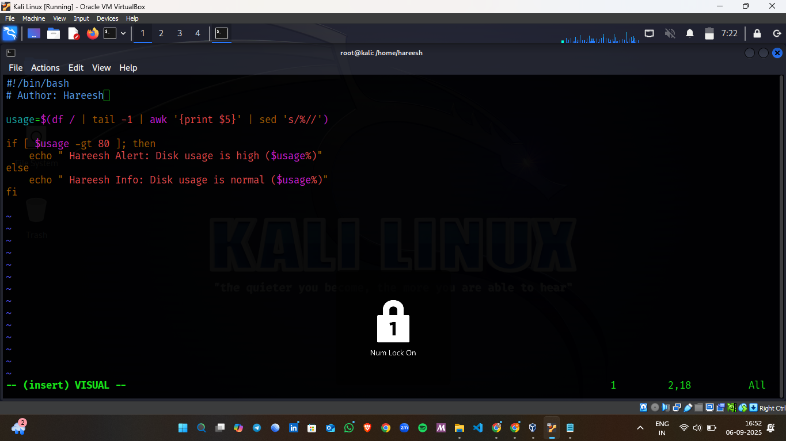

# 📅 Day 2 – Shell Scripting Intermediate  

## 📌 Overview  
This folder contains my **Day 2 practice scripts** in Shell Scripting.  
On this day, I explored **loops, functions, case statements, file handling, and basic monitoring scripts**.  
Each script includes my name **Hareesh** in the output so that it is uniquely identified as my work.  

---

## 📂 Files  

1. 
     

2.  
     

3.   
     

4.  
     

5. 
     

---

## ▶️ How to Run  

Make script executable:  
```bash
chmod +x scriptname.sh
