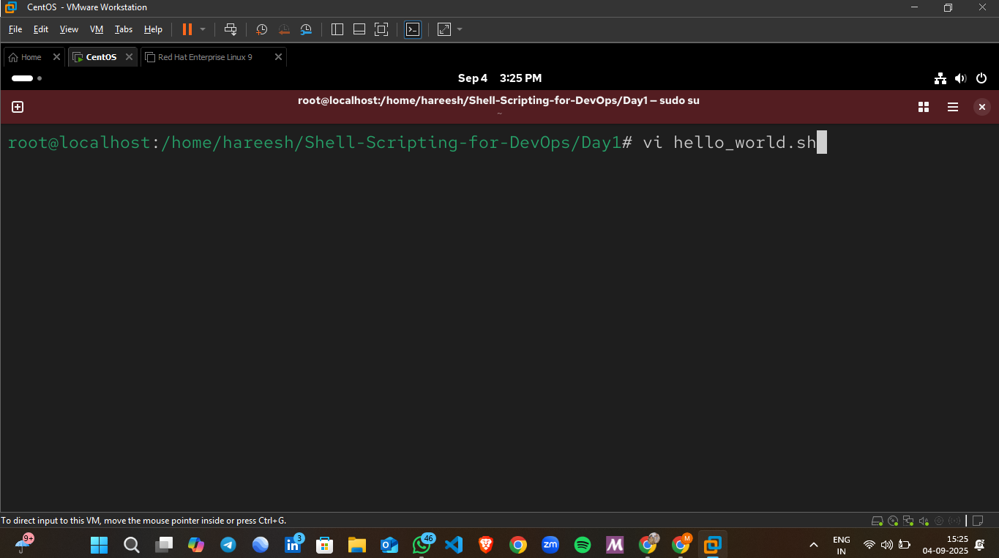
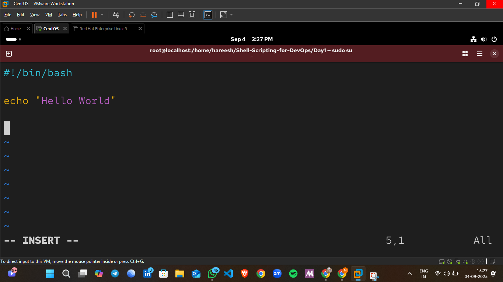
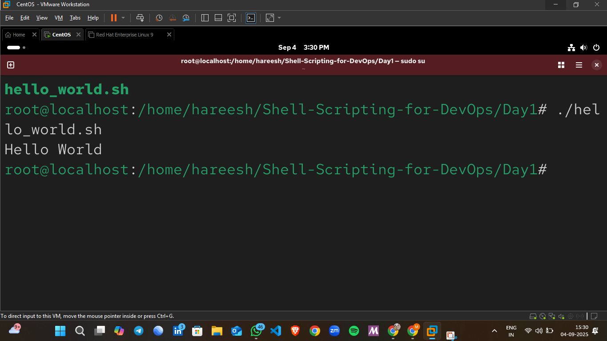
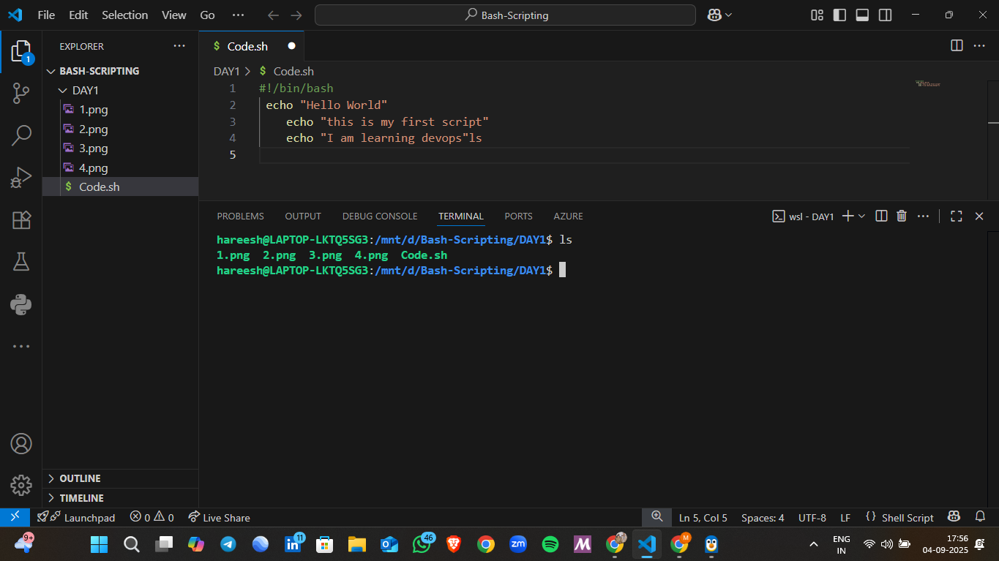
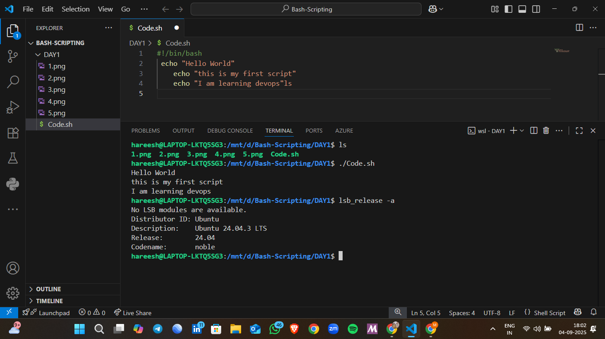
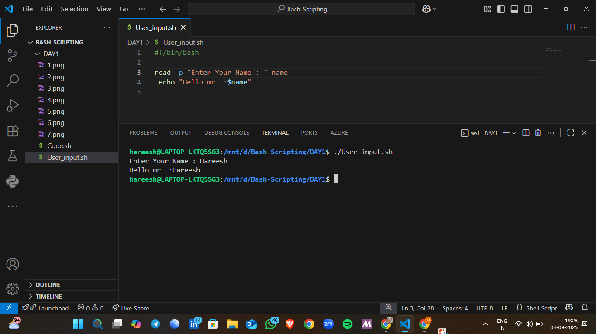

# 📅 Day 1 - Shell Scripting Basics  

## 📌 Overview  
This folder contains my **practice scripts from Day 1**.  
In these scripts, I covered the **basics of shell scripting** such as:  
- Taking user input  
- Printing output  
- Using simple conditions (`if-else`)  

---

## 📂 Files & Description  


     


     


     


 
     


     

 
     


     

     

---

## ▶️ How to Run  
To run any script, use:  
```bash
bash scriptname.sh
./scriptname.sh
